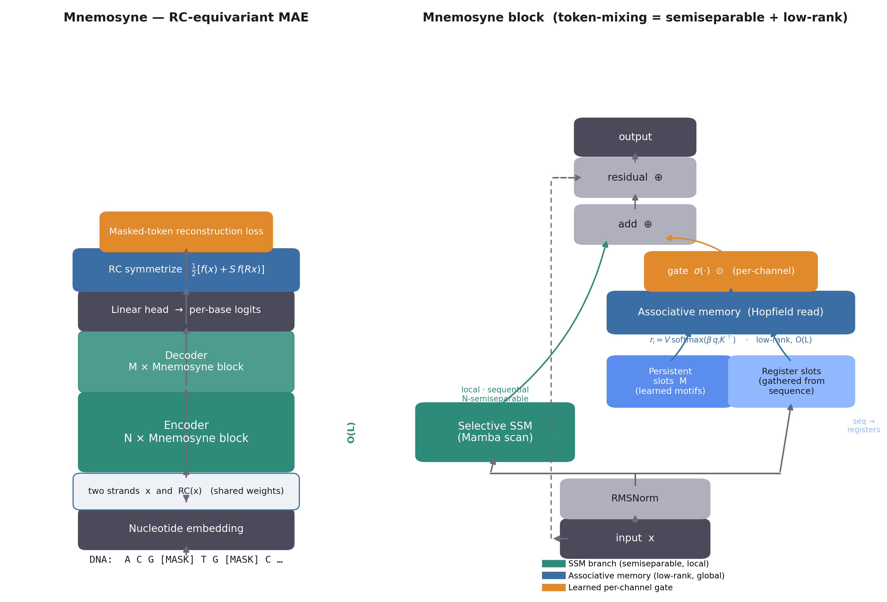

# Mnemosyne architecture



A Mnemosyne block runs two token-mixers in parallel and fuses them with a learned
per-channel gate:

```
x ─► RMSNorm ─┬─► Selective SSM (Mamba scan)  ────────────┐   semiseparable / local
              │                                           ├─► add ─► + x ─► out
              └─► Associative memory (Hopfield read) ─► gate σ⊙  low-rank / global
                    slots = [ persistent M ; registers gathered from x ]
```

### The two token-mixers
- **Selective SSM** (`ssm.py`): input-dependent Mamba S6 recurrence. Local,
  sequential, `N`-semiseparable mixing in `O(L·N)`. CPU-correct reference scan;
  fused CUDA kernel used automatically when `mamba-ssm` + GPU are present.
- **Associative memory** (`memory.py`): every position retrieves from `S = P_p+P_r`
  slots by one Modern-Hopfield softmax read, `r_i = V·softmax(β·q_iKᵀ)`.
  - **Persistent slots** `M ∈ ℝ^{P_p×d}`: learned parameters — a differentiable
    dictionary of *universal* motifs.
  - **Register slots** `∈ ℝ^{P_r×d}`: gathered from the current sequence by
    cross-attention from `P_r` learned latents (Perceiver-style bottleneck) —
    per-sequence, **distance-independent** recall.

### Key properties
- **Linear time.** Effective token-mixing = `N`-semiseparable **+** rank-`≤S`
  (Thm. 1 in the paper): `O(L·(N+P_p+P_r)·d)`, no `L×L` matrix ever formed.
- **RC-equivariant.** Output is symmetrized `½[f(x)+S·f(Rx)]`; equivariance is
  exact (proved; tested to 0.0). Pooled features are RC-invariant.
- **Active-memory diagnostics.** Gate activation, Hopfield energy, and slot usage
  are logged so an inert memory (v1's failure) is caught immediately.

### Files
| File | Role |
|------|------|
| `src/mnemosyne/config.py` | `MnemosyneConfig` (all hyperparameters) |
| `src/mnemosyne/ssm.py` | selective SSM (CPU scan + CUDA fast path) |
| `src/mnemosyne/memory.py` | unified associative memory + energy/usage diagnostics |
| `src/mnemosyne/block.py` | one Mnemosyne block (SSM ⊕ gated memory) |
| `src/mnemosyne/rcps.py` | reverse-complement ops + symmetrization |
| `src/mnemosyne/model.py` | MAE model, pooled features, `SSMBaseline` |
