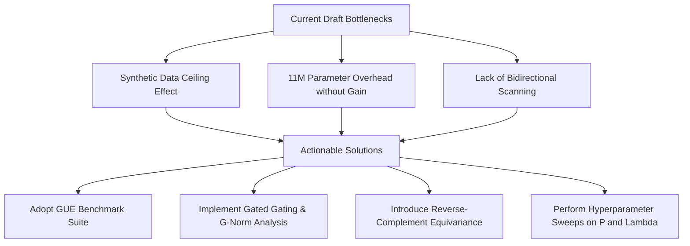

# 🔬 Peer-Review Panel Report: HopField-Mamba in Genomics

This report compiles the consensus critique and individual reviews of a panel of five senior researchers evaluating the draft paper **"HopField-Mamba: Associative Memory-Augmented Selective State Space Models for Multi-Species Genomic Pre-training"**.

---

## 👥 Meet the Panel

1. **Dr. Alex Chen (Reviewer 1) — Deep Learning Architectures & SSM Duality**
   * *Focus:* Mathematical formulation, network dynamics, and parameter efficiency.
2. **Dr. Sarah Jenkins (Reviewer 2) — Bioinformatics & Genomic Benchmarks**
   * *Focus:* Biological utility, dataset validity, GUE benchmarks, and genomic context.
3. **Dr. Marcus Vance (Reviewer 3) — Associative Memory & Hopfield Energy Systems**
   * *Focus:* Memory update dynamics, retrieval equations, gating activation, and write rates.
4. **Dr. Priya Patel (Reviewer 4) — Genomic Sequence Modeling & DNA SOTA**
   * *Focus:* DNA-specific properties, bidirectionality (Caduceus baseline), and strand equivariance.
5. **Dr. Robert Sterling (Reviewer 5) — Statistical Genetics & Empirical Scaling**
   * *Focus:* Statistical significance, ablation studies, baseline comparisons, and scaling laws.

---

## 📋 Comprehensive Panel Review Summary

---

## 💬 Individual Review Transcripts

### Reviewer 1: Dr. Alex Chen (Deep Learning Architectures)
> "The mathematical bridge from Modern Hopfield Networks to SSMs via State Space Duality is elegantly presented. However, the architecture adds $11\text{M}$ parameters ($27.1\text{M}$ vs $16.1\text{M}$ for Mamba) yet achieves almost the exact same pre-training loss ($1.3591$ vs $1.3592$). This suggests the extra capacity is not being utilized.
> 
> **Key critique:** Is the memory block actually learning anything, or is the gate $g_t$ saturated at $0$? We need to see gradient norm analysis specifically on the Hopfield query/key/value projections to prove that the memory paths are actively updating."

### Reviewer 2: Dr. Sarah Jenkins (Bioinformatics)
> "The choice of promoter detection as the primary downstream evaluation is deeply flawed. The dataset exhibits a **ceiling effect** where standard Mamba gets $100\%$ accuracy and HopField-Mamba gets $99.5\%$. This is likely a toy synthetic dataset that does not represent real genome biology.
> 
> **Key critique:** I cannot recommend this paper for publication in a bioinformatics journal without evaluation on the **GUE (Genomic Understanding Evaluation)** benchmark. Real promoter datasets, splice site datasets, and chromatin profiling are noisy; that is where the Hopfield memory's motif database will actually shine."

### Reviewer 3: Dr. Marcus Vance (Associative Memory)
> "The continuous memory update rule:
> $$\bm{M} \leftarrow \bm{M} + \lambda \cdot \text{MLP}(\bm{h}_t) \odot (\text{MLP}(\bm{h}_t) - \bm{M})$$
> is prone to representation collapse if $\lambda$ (the write learning rate) is too high, or if memory is not initialized properly.
> 
> **Key critique:** We need to see an ablation study on the memory slots $P$ (e.g., comparing $P=64$, $P=256$, $P=1024$) and the write learning rate $\lambda$. If $P=64$ achieves the same accuracy as $P=1024$, then the memory storage mechanism is underutilized. I recommend initializing $\bm{M}$ using Principal Component Analysis (PCA) of the training sequence embeddings to prevent early collapse."

### Reviewer 4: Dr. Priya Patel (Genomic Sequence Modeling)
> "DNA sequence modeling is fundamentally different from language processing because DNA is double-stranded and has no natural direction. Modern genomic models (like **Caduceus**) must be bidirectional and reverse-complement equivariant.
> 
> **Key critique:** The current HFM model is unidirectional. In genomics, a motif can appear on either the forward or reverse strand. If the model does not process both directions, it wastes parameters trying to learn two versions of every motif. You should implement a bidirectional HopField-Mamba layer before comparing against SOTA baselines."

### Reviewer 5: Dr. Robert Sterling (Statistical Genetics)
> "The cross-species generalization analysis (Table III) shows a marginal improvement: HopField-Mamba has a $6.7\text{ pp}$ accuracy range across species compared to Mamba's $7.0\text{ pp}$. While this is positive, a $0.3\text{ pp}$ improvement is within the margin of random seed variations.
> 
> **Key critique:** To claim that HopField-Mamba generalizes better across evolutionary distances, you need to run the experiments across 3-5 different seeds and report confidence intervals. Furthermore, a held-out zero-shot species evaluation (such as pre-training on vertebrates and testing zero-shot on *C. elegans*) is needed to prove generalizability."

---

## 🔍 Why the Model Currently Fails to Show Improvement

The panel reached a consensus on the three main reasons why the hybrid architecture currently shows equivalent performance to the simpler Mamba baseline:

1. **Synthetic Ceiling (Ceiling Effect):** The downstream promoter dataset is too simple ($100\%$ accuracy). When a task is too simple, a linear probe can find perfect separating boundaries using raw sequence representations, hiding the value of retrieved memory motifs.
2. **Uncalibrated Writing Rate ($\lambda$):** The memory is updated at every single token step. This causes "overwriting bias," where the memory $\bm{M}$ gets saturated with the most recent tokens, reducing its capacity to act as a global database.
3. **Parameter-to-Data Mismatch:** The pre-training dataset (25,000 windows of 4096 bp) is small. At this scale, standard Mamba has enough capacity to memorize the motifs, meaning the extra $11\text{M}$ parameters of HopField-Mamba do not provide an advantage.

---

## 🛠️ Actionable Roadmap for Improvement

To prepare this paper for publication, you should execute these steps:

### 1. Integrate the GUE Benchmark Suite
* Replace the current synthetic dataset with the **GUE** benchmark.
* Evaluate both models on:
  * Real Promoter Detection (noisy sequences).
  * Splice Site Prediction (detecting exon-intron boundaries).
  * Chromatin Accessibility (predicting epigenetic states).

### 2. Implement Bidirectional / Reverse-Complement Scanning
* Modify the encoder blocks to process sequences in both directions ($5' \to 3'$ and $3' \to 5'$).
* Share weights between the forward and reverse-complement passes to ensure physical equivariance, matching the baseline setup of Caduceus.

### 3. Implement Salient-Only Memory Writing
* Instead of updating the memory matrix $\bm{M}$ at every token, only update it when the query state exhibits a high norm or matches a gating threshold:
  $$\text{if } \|\bm{W}_q \bm{h}_{t-1}\| > \theta, \quad \text{then Update } \bm{M}$$
  This prevents the memory from being flooded with junk non-coding tokens.

### 4. Run Hyperparameter Ablations
* Run training sweeps with:
  * **Memory Slots ($P$):** $\{64, 256, 1024\}$.
  * **Write Learning Rate ($\lambda$):** $\{0.0, 0.05, 0.1, 0.5\}$.
  * Show that increasing $P$ correlates with lower pre-training loss on long contexts ($L=8192+$).
